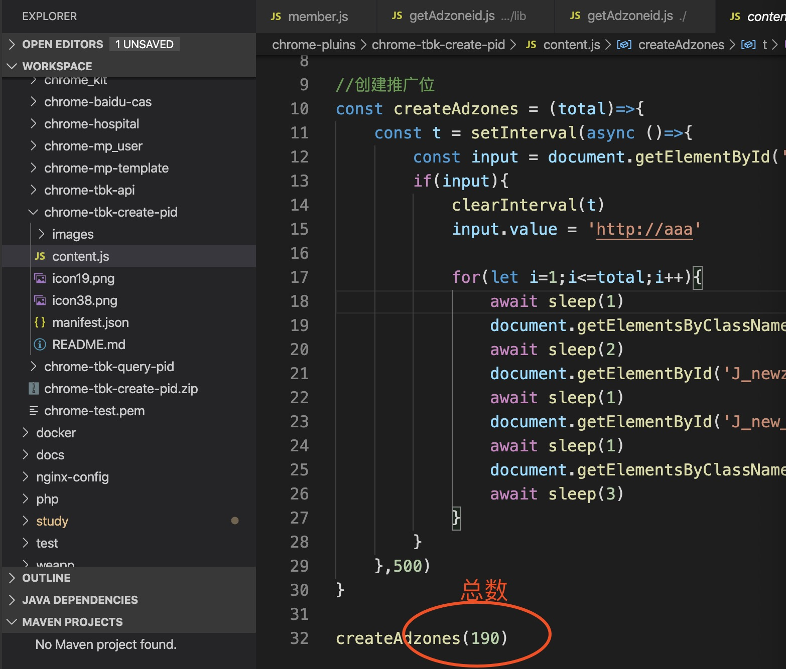
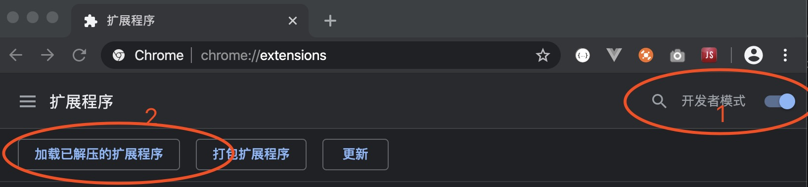
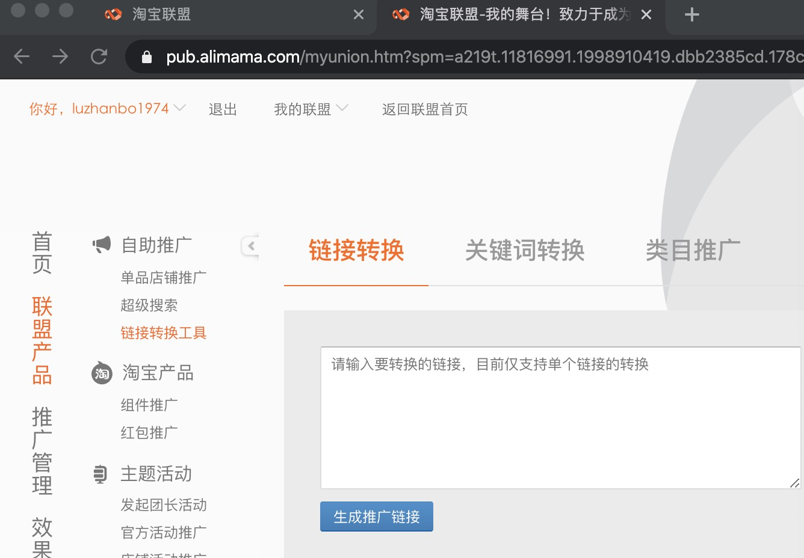

# 下载插件代码到本地
根据需要修改好一次要创建的推广位总数，见下图 

# 安装插件
## 打开开发者模式
打开chrome，在地址栏输入：chrome://extensions/，图1

## 加载插件
加载已解压的扩展程序,图2，选择下载代码的目录

# 运行插件
## 进入淘宝联盟后台，打开链接转换工具 
https://pub.alimama.com/myunion.htm?spm=a219t.11816991.1998910419.dbb2385cd.178c75a5J2TlYA#!/promo/self/links

## 好了，等待工具自动创建吧

# 需要开发淘宝客相关应用或者有问题，联系我 
+ QQ：61315986
+ 留言：淘宝客
  
